# VH Labs - AI Investor Engagement Platform
## Executive Overview

**Version**: 1.0
**Last Updated**: January 2026
**For**: Business Stakeholders & Team Members

---

## Table of Contents

1. [Executive Summary](#executive-summary)
2. [The 4 Systems Explained](#the-4-systems-explained)
3. [How Your Data Flows](#how-your-data-flows)
4. [The 9 Investor Segments](#the-9-investor-segments)
5. [The 8 Investor Statuses](#the-8-investor-statuses)
6. [What Happens Automatically](#what-happens-automatically)
7. [Integrations Overview](#integrations-overview)
8. [Key Benefits Summary](#key-benefits-summary)
9. [Glossary](#glossary)

---

## Executive Summary

The VH Labs AI Investor Engagement Platform is your automated relationship manager that never forgets to follow up. It watches every call you make, every workshop you record, and every investor you talk to—then automatically sends perfectly-timed, personalized check-ins to keep relationships warm without feeling salesy.

**The core philosophy**: "A setter where there's no intention to close the person, you're just getting an update, people have way lower sales resistance."

Instead of pitching, the system sends casual updates, shares valuable content, and asks thoughtful questions—all customized to each investor's interests and timeline. Behind the scenes, AI categorizes your contacts, extracts golden moments from your content, and coordinates outreach across email, text, and social media. You focus on conversations that matter; the platform handles the nurturing.

---

## The 4 Systems Explained

### System 1: The Relationship Manager
**What It Does**: Acts as your tireless setter who reads call notes, understands what each investor wants, and sends friendly check-ins at just the right time.

**Problem It Solves**: You finish a call thinking "I should follow up in 2 weeks," but life gets busy and that follow-up never happens. Investors go cold not because they lost interest, but because they forgot about you.

**Real-World Example**:
You hop off a call with Maria. She's interested in multifamily properties but mentioned "bad timing, maybe in 3 months." The system reads your notes, tags her as "Passive Investor," and automatically schedules a no-pressure check-in for 3 weeks from now. When the time comes, it generates a message like:

> "Hey Maria, hope you're doing well! Came across an article on multifamily financing strategies and thought of you. No rush—just wanted to share. How have things been on your end?"

Maria replies positively. The system instantly upgrades her status to "Active Investor" and increases follow-up frequency. You never manually set a reminder—it just works.

---

### System 2: The Content Goldmine
**What It Does**: Watches your Slack channel for tagged calls and workshops, then uses AI to pull out the best quotes, stories, and teaching moments automatically.

**Problem It Solves**: You record an amazing workshop with 6 solid teaching points, but extracting those moments, writing emails, and creating social posts takes hours you don't have. So the content sits unused.

**Real-World Example**:
Ashley tags a workshop recording in Slack with the 🏠 emoji (meaning it's for Real Estate Investors). Within 5 minutes, AI has:
- Transcribed the entire 45-minute video
- Extracted 8 shareable quotes (hooks)
- Identified 4 clips perfect for Instagram (30-90 seconds each)
- Determined the primary audience (RE Investors) and secondary audience (Wholesalers)
- Assigned a content score (78/100) based on quality

The content is now ready to be distributed with zero manual work.

---

### System 3: The Distribution Engine
**What It Does**: Takes your processed content and automatically sends it to the right people through the right channels (email, text, or social media).

**Problem It Solves**: You have great content, but manually deciding "who gets this?" and "email or text?" for 500+ contacts is impossible. Content either goes to everyone (irrelevant spam) or no one (wasted effort).

**Real-World Example**:
That workshop Ashley tagged goes through the distribution engine. It automatically:
- Sends an email teaser to 143 Real Estate Investors: "Just dropped a breakdown of a deal that turned $40K into $120K in 90 days..."
- Texts 27 Hot Leads in that group with a shorter version
- Posts the best clip to Instagram with a caption and hashtags
- Schedules a follow-up email in 3 days to anyone who didn't open the first one

Each message is personalized with the recipient's name and interests. No manual list building, no copy-paste.

---

### System 4: The Orchestration Layer
**What It Does**: The behind-the-scenes conductor that makes sure all the other systems talk to each other smoothly, logs everything, and catches errors before they become problems.

**Problem It Solves**: When you run multiple automated systems, things can break silently. A webhook fails, a contact gets stuck, an AI call times out—and you don't find out until weeks later.

**Real-World Example**:
The Note Parser (System 1) tries to call the AI service but gets a "rate limit exceeded" error. Instead of silently failing:
- System 4's Error Logger immediately logs the issue to the database
- It sends a Slack alert: "Warning: Note Parser failed for contact John Doe due to rate limit"
- The Analytics Logger tracks this as a system event
- The system automatically retries the call 5 minutes later when the rate limit resets

You see a quick Slack notification, but the system self-heals without your intervention.

---

## How Your Data Flows

### Journey 1: New Investor Contact (From Call → Personalized Outreach)

```mermaid
flowchart TD
    A[📞 You Finish a Call] --> B[💬 Add Notes in GHL]
    B --> C{🤖 AI Note Parser}
    C --> D[Extracts: Intent, Timeline, Objections]
    D --> E[🏷️ Assigns Segment & Status]
    E --> F[Hot Lead / Active / Passive / etc.]
    F --> G[📅 Schedules Next Touchpoint]
    G --> H[⏰ Wait for Scheduled Time]
    H --> I{🧠 AI Message Generator}
    I --> J[Creates Personalized Message]
    J --> K[📧 / 📱 Sends via Email or SMS]
    K --> L{📬 Investor Responds?}
    L -->|Yes| M[🤖 Response Classifier]
    L -->|No| N[⏰ Schedule Follow-up]
    M --> O[Interested / Question / Objection?]
    O --> P[Update Status & Route]
```

**Step-by-Step Explanation**:
1. **You finish a call** and jot down notes in GoHighLevel (your CRM)
2. **AI reads your notes** and extracts key information: Are they looking to buy? When? Any concerns?
3. **The system assigns a segment** (e.g., "RE Investor") and **status** (e.g., "Hot Lead" if they're ready soon, "Passive" if timeline is unclear)
4. **A touchpoint is automatically scheduled** based on their status (Hot Leads get follow-ups every 5-7 days, Passive every 21 days)
5. **When the time comes**, AI generates a friendly, personalized message that matches their interest and situation
6. **The message is sent** via their preferred channel (text for urgent, email for longer content)
7. **If they respond**, AI classifies the reply: Interested? Question? Objection? Unsubscribe?
8. **The system updates their status and routes the next action** (upgrade to Hot Lead, send objection-handling content, stop if they unsubscribe)

**No manual work required after step 1.**

---

### Journey 2: Content Processing Pipeline (Slack → Distribution)

```mermaid
flowchart TD
    A[🎥 Workshop Recording Posted in Slack] --> B[👍 Ashley Adds 🏠 Reaction]
    B --> C{📨 Slack Webhook}
    C --> D[Creates Content Record]
    D --> E[Status: Pending]
    E --> F{🎙️ Has Transcript?}
    F -->|No| G[🤖 AI Transcription]
    F -->|Yes| H[Clean Transcript]
    G --> H
    H --> I{🧠 AI Content Agent}
    I --> J[Extracts Hooks, Clips, Metadata]
    J --> K[Calculates Content Score]
    K --> L[Status: Ready]
    L --> M{📤 Distribution Router}
    M --> N[🏷️ Gets Segment: RE Investors]
    N --> O[🔍 Finds 143 Contacts in Segment]
    O --> P{🧠 Teaser Generator}
    P --> Q[Creates Personalized Email for Each]
    Q --> R[📧 Sends via GoHighLevel]
    R --> S[📊 Tracks Opens & Clicks]
    S --> T{Opened but No Click?}
    T -->|Yes| U[Send Instagram Nudge]
    T -->|No| V[Send Reminder in 3 Days]
```

**Step-by-Step Explanation**:
1. **You post a workshop recording** in your designated Slack channel
2. **Ashley reviews it and adds a reaction emoji** (🏠 for RE Investors, 📚 for Coaching Students, etc.)
3. **The platform receives the Slack notification** and creates a content record marked "Pending"
4. **If there's no transcript yet**, AI transcribes the audio/video automatically
5. **The transcript is cleaned** (remove filler words, fix errors, add structure)
6. **AI Content Agent analyzes it** and extracts:
   - 5-10 shareable quotes (hooks)
   - 3-5 clip timestamps for short videos
   - Topic breakdown, summary, key points
   - Primary and secondary audiences
7. **A content score is calculated** (higher score = more hooks, better engagement predicted)
8. **Content status changes to "Ready"** and enters the distribution queue
9. **Distribution Router determines who gets this content** based on the emoji tag (RE Investors in this case)
10. **The system finds all contacts in that segment** who are active (not marked "cold" or "unsubscribed")
11. **Teaser Generator creates a custom email for each person** using their name and context
12. **Emails are sent through GoHighLevel** (your email platform for deliverability)
13. **The system tracks who opens and who clicks** the video link
14. **If someone opens but doesn't click**, they get a follow-up: "Check it out on Instagram instead!"
15. **If they don't open at all**, a reminder email goes out in 3 days with a different subject line

**Ashley's only job**: Tag the content with an emoji. The rest is automatic.

---

## The 9 Investor Segments

Your contacts are automatically categorized into 9 segments based on their interests and behavior. Each segment gets content tailored to their needs.

| Segment | Who They Are | What Content They Get | Primary Channel |
|---------|--------------|----------------------|-----------------|
| **RE Investors** | Active property buyers and flippers | Deal analysis, ROI breakdowns, investment strategies, case studies | Email + Instagram |
| **House Buyers** | People looking to buy a home to live in | Home buying tips, financing advice, what to look for in properties | SMS (quick tips) + Email |
| **Bird Doggers** | Deal scouts who find properties for fees | How to find off-market deals, negotiation tactics, earning potential | Email |
| **JV Partners** | People looking for joint venture partnerships | Partnership structures, capital strategies, co-investment opportunities | Email (professional tone) |
| **Coaching Students** | Enrolled in training programs | Implementation guides, success stories, motivational content, mindset | Email + Instagram |
| **Wholesalers** | Investors who flip contracts without buying properties | Wholesale strategies, contract tips, quick-flip tactics | Email + Instagram |
| **Lenders** | People who provide funding for deals | Market data, deal flow updates, return opportunities | Email (data-focused) |
| **Sellers** | Property owners looking to sell | Selling process guides, timing advice, value maximization | SMS (property-specific) + Email |
| **General Leads** | Unsegmented prospects, not sure what they want yet | Beginner education, intro to real estate investing, FAQs | Email + Instagram |

**How Contacts Get Categorized**:
- **From call notes**: If notes mention "looking for JV partners," they're tagged as JV Partners
- **From behavior**: If they open every email about wholesale strategies, they may be moved to Wholesalers
- **Manual tagging**: You can always override and manually assign a segment in GoHighLevel

**Why This Matters**:
Instead of sending the same generic email to 500 people (leading to unsubscribes), each person gets content that actually applies to them. A Bird Dogger doesn't care about seller tips, and a Lender doesn't need home buying advice.

---

## The 8 Investor Statuses

While segments describe *what they're interested in*, statuses describe *how engaged they are*. Statuses determine how often the system reaches out.

| Status | What It Means | Touchpoint Frequency | Example Signals |
|--------|---------------|---------------------|-----------------|
| **Hot Lead** | Strong buying intent, ready to move within 1-3 months | Every 5-7 days | "Ready to close", "Looking now", Specific property interests mentioned |
| **Active Investor** | High engagement, asks questions, responds regularly | Every 10-14 days | Multiple interactions, recent activity, asking for details |
| **Passive Investor** | Interested but not taking action yet | Every 21 days | "Open to opportunities", "Maybe later", Long timeline (6+ months) |
| **JV Potential** | Looking for partnership or capital opportunities | Every 14 days | "Looking for partners", Capital discussions, Team-up interest |
| **Tire Kicker** | Low intent, browsing without clear plan | Every 30 days | "Just curious", No follow-through, Vague interest |
| **Objection Holder** | Expressed concerns or barriers | Every 30 days | "Too expensive", "Bad timing", Specific worries mentioned |
| **Dormant** | Past engagement but inactive for 6+ months | Every 45 days | No responses, Dropped off, Haven't engaged in months |
| **Cold** | No response history or requested to stop contact | Do not contact | Never engaged, Unsubscribed, Explicitly not interested |

**How the System Updates Status Automatically**:

| What Happens | Status Change | Why |
|--------------|---------------|-----|
| Contact responds positively to 3+ messages + mentions buying soon | → Hot Lead | Shows clear intent and engagement |
| No response for 30 days | Active → Passive | Losing engagement |
| No response for 180 days | Any → Dormant | Completely inactive |
| Reply says "Not interested" or "Unsubscribe" | Any → Cold | Respect their wishes, stop all automation |
| Objection detected in notes ("too expensive", "not ready") | Any → Objection Holder | Trigger value-focused content, not sales |
| JV language detected ("looking for partners") | Any → JV Potential | Route to partnership-focused messaging |
| Positive response after being Dormant | Dormant → Active | Re-engaged, resume regular cadence |

**Example in Action**:
Sarah starts as a **Passive Investor** (gets messages every 21 days). She responds to 3 messages in a row asking questions about a deal. System upgrades her to **Active Investor** (now every 10-14 days). Two months pass with no responses. System moves her to **Dormant** (now every 45 days with re-engagement content). She replies to a re-engagement message. System moves her back to **Active** and resumes regular contact.

---

## What Happens Automatically

Here's what the platform does **without any manual work** from you:

### Content Processing
- ✅ **When Ashley tags a Slack message with 🏠**, the system transcribes the recording, extracts 8 shareable quotes, identifies 4 video clip timestamps, determines it's for RE Investors and Wholesalers, scores it 78/100, and queues it for distribution—all in under 5 minutes.
- ✅ **When a workshop is 45 minutes long**, AI summarizes it into a 3-sentence overview, breaks it into topic chapters, labels speakers, and generates Instagram captions automatically.
- ✅ **When content is marked as "high priority" (🔥 emoji)**, it jumps to the front of the distribution queue and gets sent within 2 hours instead of the next batch.

### Contact Management
- ✅ **When you add call notes in GoHighLevel**, AI reads them, extracts timeline ("ready in 3 months"), objections ("worried about financing"), and intent ("looking to buy multifamily"), then assigns the contact to RE Investors segment and Passive Investor status.
- ✅ **When a contact is classified as Hot Lead**, they automatically get check-ins every 5-7 days instead of every 21 days.
- ✅ **When a contact doesn't respond for 30 days**, their status downgrade to Passive and message frequency decreases to avoid annoying them.
- ✅ **When a contact replies saying "Not interested"**, they're immediately marked Cold, removed from all automated sequences, and flagged for human review.

### Outreach & Follow-Up
- ✅ **Every morning at 8am**, the system checks who's due for a touchpoint based on their status and last contact date, then queues personalized messages for the day.
- ✅ **When a Hot Lead is due for follow-up**, AI generates a message referencing their specific interests: "Hey Marcus, saw a multifamily property in your area that reminded me of what you mentioned. Want details?"
- ✅ **When an email is opened but the link isn't clicked within 48 hours**, a follow-up is sent with a different angle: "Missed this? Here's the Instagram version if that's easier to watch."
- ✅ **When a contact responds with a question**, AI classifies it as "question," routes it to the human response queue, and drafts a suggested answer for your review.

### Cross-Channel Coordination
- ✅ **When content is sent to RE Investors via email**, the best 30-second clip is simultaneously posted to Instagram with auto-generated hashtags and caption.
- ✅ **When an Instagram post goes live**, all email recipients get an updated message: "📱 Also watch on Instagram: [link]" to boost cross-platform engagement.
- ✅ **When a contact is tagged as "prefers SMS"**, they get short-form texts instead of longer emails, even for the same content.

### Error Handling & Monitoring
- ✅ **When an AI call fails due to rate limits**, the system logs the error, alerts you via Slack, waits 5 minutes, and retries automatically.
- ✅ **When someone hard bounces (bad email address)**, they're removed from email lists immediately to protect sender reputation.
- ✅ **When a workflow breaks**, Error Logger saves all details to the database and notifies you with exactly which step failed and why.

---

## Integrations Overview

The platform connects several best-in-class tools to work together seamlessly. You don't need to know how they work—just know what they do.

| Tool | What It Does | Why It Matters |
|------|--------------|----------------|
| **Slack** | Team communication platform | Where Ashley tags content with reactions. Acts as the intake point for all recordings and content. |
| **GoHighLevel (GHL)** | Customer relationship manager (CRM) | Stores all contact information, sends emails and texts, tracks conversations. Your single source of truth for who you're talking to. |
| **Supabase** | Database for content and analytics | Stores all processed content, hooks, clips, and distribution records. Powers the dashboard so you can see what's been sent and to whom. |
| **Claude AI (Anthropic)** | Artificial intelligence for reading and writing | Reads call notes to understand intent, generates personalized messages, extracts quotes from transcripts. The "brain" of the system. |
| **n8n** | Automation platform (the "glue") | Connects everything together. When Slack sends a notification, n8n tells Supabase to create a record, calls Claude AI to process it, then tells GHL to send emails. You never see this—it just works. |
| **Instagram** (Optional) | Social media for short video clips | Automatically posts your best content clips with captions and hashtags. Increases reach beyond email. |

**How They Work Together**:
Think of it like a relay race. Slack hands the baton to n8n → n8n hands it to Claude AI → Claude hands it to Supabase → Supabase hands it to n8n again → n8n hands it to GHL → GHL sends the email. Each tool is an expert at one thing, and n8n makes sure they all coordinate perfectly.

You interact with **Slack** (to tag content) and **GoHighLevel** (to manage contacts and add call notes). Everything else runs in the background.

---

## Key Benefits Summary

### 🚀 Speed
- Content processing: **5 minutes** from Slack tag to distribution-ready (vs. 2+ hours manually)
- Follow-up scheduling: **Instant** after every call (vs. hoping you remember later)
- Personalization at scale: **500 custom emails in 10 minutes** (vs. days of copy-paste)

### 🎯 Precision
- Right message to right person: **9 segments** ensure content relevance
- Right timing: **8 status levels** determine frequency (don't annoy, don't ghost)
- Right channel: **Automatic routing** to email, SMS, or social based on preference

### 💰 Efficiency
- **Zero manual follow-ups** after initial call notes entry
- **Zero manual content creation** after Ashley's emoji tag
- **Zero manual list segmentation** (AI does it from notes)

### 🧠 Intelligence
- **AI learns** what content performs best with which segments
- **Status updates automatically** based on engagement patterns
- **Objections detected** and trigger specific value content (not more pitches)

### 📊 Visibility
- **Dashboard shows** all distributed content, open rates, engagement by segment
- **Analytics track** which hooks get the most clicks, which segments respond best
- **Error logging** catches issues before they snowball

### 🛡️ Reliability
- **Automated retries** when APIs fail temporarily
- **Deliverability protection** (auto-remove bounces, honor unsubscribes)
- **Human fallback** for complex questions the AI can't handle

---

## Glossary

**Term** | **Plain English Explanation**
---------|-------------------------------
**AI (Artificial Intelligence)** | Software that can read text, understand meaning, and write human-like responses. In this system, it reads your call notes and generates personalized messages.
**API** | A way for two software tools to talk to each other automatically. Like a telephone line between Slack and the platform.
**CRM (Customer Relationship Manager)** | Software for managing contacts and tracking conversations. In this case, GoHighLevel.
**Distribution** | Sending content (like an email or text) to a group of people.
**Hook** | A short, attention-grabbing quote or phrase from your content (usually under 50 words). Example: "This flip strategy turned $40K into $120K in 90 days."
**n8n** | The automation platform that connects all the tools together behind the scenes. Think of it as the "conductor" of the orchestra.
**Segment** | A group of contacts with similar interests. Example: "RE Investors" is a segment of people interested in buying rental properties.
**Slack** | Team chat app where Ashley tags content with emoji reactions.
**Status** | How engaged a contact is. Example: "Hot Lead" means they're ready to buy soon; "Dormant" means they haven't responded in 6+ months.
**Supabase** | The database that stores all content, hooks, and distribution records. Powers the analytics dashboard.
**Touchpoint** | Any time you reach out to a contact (email, text, call, etc.). Also called a "check-in" or "follow-up."
**Transcript** | Written text version of an audio or video recording. The AI reads this to extract hooks and clips.
**Webhook** | A notification one app sends to another when something happens. Example: Slack sends a webhook to n8n when Ashley adds an emoji reaction.
**Workflow** | A series of automated steps. Example: "When Slack sends webhook → Create content record → Transcribe audio → Extract hooks → Queue for distribution."

---

**End of Executive Overview**

For technical details on how to operate, configure, and troubleshoot the system, see the **Technical Operations Guide**.

