# VH Labs - AI Investor Engagement Platform
## Technical Operations Guide

**Version**: 1.0
**Last Updated**: January 2026
**For**: Technical Administrators, Marketing Ops, Future Developers

---

## Table of Contents

1. [Platform Architecture Overview](#platform-architecture-overview)
2. [Database Schema](#database-schema)
3. [n8n Workflows Summary](#n8n-workflows-summary)
4. [GoHighLevel Configuration](#gohighlevel-configuration)
5. [AI Prompts Reference](#ai-prompts-reference)
6. [Data Flow Diagrams](#data-flow-diagrams)
7. [Environment & Credentials](#environment--credentials)
8. [Operational Procedures](#operational-procedures)
9. [Appendix](#appendix)

---

## Platform Architecture Overview

### High-Level Architecture


### Technology Stack

| Layer | Technology | Version | Purpose |
|-------|------------|---------|---------|
| **Orchestration** | n8n Cloud | Latest | Workflow automation, integration hub |
| **CRM/Delivery** | GoHighLevel | API v1/v2 | Contact management, email/SMS delivery |
| **Database** | Supabase (PostgreSQL) | 15+ | Content library, analytics, prompts storage |
| **Dashboard** | Next.js + React Query | 14.x | Admin UI for content pipeline visibility |
| **AI** | Claude API (Anthropic) | Sonnet 4.5 | Content extraction, note parsing, messaging |
| **Transcription** | Assembly AI / Whisper | Latest | Audio/video to text conversion |
| **Social** | Instagram Graph API | v18.0 | Automated posting |

### System Interconnections


---

## Database Schema

### Entity Relationship Diagram


### Core Tables

#### segments
**Purpose**: Defines the 9 audience segments for content routing
**Key Fields**:
- `slug`: Machine-readable identifier (e.g., `re_investors`)
- `emoji`: Slack reaction emoji mapped to this segment
- `routing_rules`: JSON object with channel preferences
- `channel_primary`: Default distribution channel (email, sms, instagram)

**Sample Data**:
```sql
SELECT slug, name, emoji, channel_primary FROM segments;
```
| slug | name | emoji | channel_primary |
|------|------|-------|-----------------|
| re_investors | RE Investors | 🏠 | email |
| house_buyers | House Buyers | 🏡 | sms |
| bird_doggers | Bird Doggers | 🐶 | email |

#### investor_statuses
**Purpose**: Defines the 8 engagement statuses and touchpoint frequency
**Key Fields**:
- `touchpoint_frequency_days`: How often to contact (NULL for "cold" = never)
- `priority_level`: 1-7, where 1 is highest priority
- `signals`: Array of phrases that indicate this status

**Touchpoint Frequency Rules**:
```sql
SELECT slug, touchpoint_frequency_days, priority_level
FROM investor_statuses
ORDER BY priority_level;
```
| slug | touchpoint_frequency_days | priority_level |
|------|---------------------------|----------------|
| hot_lead | 5 | 1 |
| active_investor | 10 | 2 |
| jv_potential | 14 | 2 |
| passive_investor | 21 | 3 |
| objection_holder | 30 | 4 |
| tire_kicker | 30 | 5 |
| dormant | 45 | 6 |
| cold | NULL | 7 |

#### contents
**Purpose**: Stores all content from Slack intake through distribution
**Key Fields**:
- `status`: Workflow status (pending → processing → ready → distributed → archived)
- `hooks`: JSON array of extracted hooks from AI
- `clips`: JSON array of video clip timestamps
- `audiences`: Array of segment slugs this content targets
- `score`: 0-100 calculated score based on hook quality, engagement prediction
- `ai_metadata`: Full AI extraction response for debugging

**Content Status Lifecycle**:
1. `pending`: Just created from Slack
2. `processing`: AI extraction in progress
3. `ready`: Processed and ready for distribution
4. `distributed`: Sent to contacts
5. `archived`: No longer active

#### contacts_sync
**Purpose**: Mirror of GoHighLevel contacts with additional scoring/tracking
**Key Fields**:
- `ghl_id`: Foreign key to GoHighLevel contact ID
- `segment` & `investor_status`: Current categorization
- `parsed_notes`: JSON object from AI note parsing
- `last_touchpoint_at`: Last automated message sent
- `last_synced_at`: Last sync from GHL

**Sync Strategy**: Hourly pull from GHL API via S4-03 workflow, upsert based on `ghl_id`

#### distributions
**Purpose**: Tracks every piece of content sent to every contact
**Key Fields**:
- `content_id`: Which content was sent
- `ghl_contact_id`: Who received it
- `channel`: How it was sent (email, sms, instagram)
- `opened_at`, `clicked_at`: Engagement tracking (from GHL webhooks)
- `external_id`: GHL message ID or Instagram post ID for tracking

**Query Example** - Get engagement rate for a content piece:
```sql
SELECT
  content_id,
  COUNT(*) as sent_count,
  COUNT(opened_at) as open_count,
  COUNT(clicked_at) as click_count,
  ROUND(100.0 * COUNT(opened_at) / COUNT(*), 2) as open_rate,
  ROUND(100.0 * COUNT(clicked_at) / COUNT(*), 2) as click_rate
FROM distributions
WHERE content_id = 'some-uuid'
GROUP BY content_id;
```

---

## n8n Workflows Summary

### Workflow Inventory

| System | Workflow ID | Name | Trigger | Purpose | Connected Systems |
|--------|-------------|------|---------|---------|-------------------|
| **System 1: AI Setter** |
| S1 | S1-01 | Note Parser | Webhook (GHL contact update) | Parse call notes, extract intent/objections/timeline | GHL → Claude AI → Supabase |
| S1 | S1-02 | Segmentation Engine | Called by S1-01 | Apply segmentation rules, update tags | Supabase → GHL |
| S1 | S1-03 | Touchpoint Scheduler | Cron (daily 8am) | Query contacts due for touchpoint, create queue entries | Supabase |
| S1 | S1-04 | Setter Message Generator | Called by S1-03 | Generate personalized check-in messages using AI | Supabase → Claude AI |
| S1 | S1-05 | Setter Message Sender | Queue trigger | Send queued messages via GHL | Supabase → GHL |
| S1 | S1-06 | Response Handler | Webhook (GHL message reply) | Classify replies, route to appropriate action | GHL → Claude AI → Supabase |
| **System 2: Content Pipeline** |
| S2 | S2-01 | Slack Intake | Webhook (Slack reaction_added) | Create content record from Slack tags | Slack → Supabase → S2-02 |
| S2 | S2-02 | Content Processor | Called by S2-01 | AI extraction pipeline (hooks, clips, metadata) | Supabase → S2-03 → Claude AI |
| S2 | S2-03 | Transcript Processor | Called by S2-02 | Transcribe and clean audio/video | Supabase → Assembly AI / Whisper |
| **System 3: Distribution** |
| S3 | S3-01 | Distribution Router | Manual or Webhook (content ready) | Route content to appropriate channels | Supabase → S3-02/S3-04/S3-05 |
| S3 | S3-02 | Email Generator | Called by S3-01 | Generate personalized email teasers | Supabase → Claude AI |
| S3 | S3-03 | Email Sender | Queue trigger | Send emails via GHL | Supabase → GHL |
| S3 | S3-04 | Instagram Poster | Called by S3-01 | Post clips to Instagram with captions | Supabase → Claude AI → Instagram |
| S3 | S3-05 | SMS Sender | Called by S3-01 | Send SMS via GHL | Supabase → GHL |
| S3 | S3-06 | SMS Queue Writer | Called by S3-05 | Create SMS queue entries | Supabase |
| **System 4: Utilities** |
| S4 | S4-01 | Error Logger | Called by all workflows | Log errors to Supabase, alert via Slack | Supabase → Slack |
| S4 | S4-02 | Analytics Logger | Called by all workflows | Log events for analytics dashboard | Supabase |
| S4 | S4-03 | GHL Contact Sync | Cron (hourly) | Sync GHL contacts to Supabase | GHL → Supabase |

### Workflow Interconnection Map


### Key Workflow Details

#### S1-01: Note Parser
**Trigger**: Webhook from GHL when contact notes field is updated
**Input**:
```json
{
  "contact_id": "ghl_contact_uuid",
  "notes": "Spoke with Maria. Interested in multifamily. Budget $200k-$500k. Timeline: Q2 2026. Concerned about financing."
}
```
**Processing Steps**:
1. Validate payload has `contact_id` and `notes`
2. Fetch full contact record from GHL
3. Get `note_parser` prompt from Supabase
4. Call Claude API with prompt + notes
5. Parse JSON response (intent_signals, objections, timeline, etc.)
6. Upsert to `contacts_sync` table
7. Call S1-02 Segmentation Engine
8. Log analytics event

**Output**:
```json
{
  "contact_id": "ghl_contact_uuid",
  "intent_signals": ["buying", "partnering"],
  "objections": ["financing"],
  "timeline": "medium",
  "budget_range": "$200k-$500k",
  "property_interests": ["multifamily"],
  "sentiment": "positive",
  "recommended_status": "active_investor",
  "follow_up_priority": "medium"
}
```

#### S2-01: Slack Intake
**Trigger**: Slack Event Subscription webhook on `reaction_added` event
**Reaction Mapping**:
```javascript
const reactionMap = {
  'house': 're_investors',
  'house_with_garden': 'house_buyers',
  'dog': 'bird_doggers',
  'handshake': 'jv_partners',
  'books': 'coaching_students',
  'moneybag': 'wholesalers',
  'bank': 'lenders',
  'memo': 'sellers',
  'question': 'general_leads',
  'fire': '_priority',
  'star': '_featured'
};
```

**Processing Steps**:
1. Verify Slack signature (security)
2. Handle URL verification challenge
3. Filter for `reaction_added` events only
4. Get original message from Slack API
5. Map reaction emoji to segment
6. Extract source URL from message text
7. Create `contents` record with status='pending'
8. Trigger S2-02 Content Processor

**Special Flags**:
- `fire` (🔥): Sets `priority='high'`, processes immediately
- `star` (⭐): Sets `is_featured=true`, gets extra distribution

#### S2-02: Content Processor
**Trigger**: Called by S2-01 or manual
**Processing Pipeline**:
```
Start → Update status to 'processing' → Check for transcript
  ↓ (if no transcript)
  → Call S2-03 Transcript Processor
  ↓
  → Get cleaned transcript
  ↓
  → Get 'content_agent' prompt from Supabase
  ↓
  → Call Claude API with transcript (max_tokens: 4096)
  ↓
  → Parse JSON response:
    - title
    - hooks[] (5-10)
    - clips[] (3-5)
    - transcript_structured
    - metadata (primary_audience, content_type, etc.)
  ↓
  → Calculate score (base 50 + hook_count*5 + clip_count*5 + bonus)
  ↓
  → Insert hooks to hooks table
  ↓
  → Update contents record with extracted data, status='ready'
  ↓
  → Log analytics event
```

**Score Calculation**:
```javascript
let score = 50; // Base score
score += Math.min((hooks.length || 0) * 5, 25); // Max 25 points for hooks
score += Math.min((clips.length || 0) * 5, 15); // Max 15 points for clips
if (metadata.content_type === 'case_study') score += 10; // Bonus
if (is_featured) score += 15; // Featured bonus
const priority = score > 80 ? 'high' : score > 50 ? 'medium' : 'low';
```

#### S3-01: Distribution Router
**Trigger**: Manual execution or webhook when content status changes to 'ready'
**Routing Logic**:
```javascript
// Pseudo-code
for (const audience of content.audiences) {
  const segment = getSegment(audience);
  const contacts = getContactsInSegment(segment, {status: not 'cold'});

  const channels = [segment.channel_primary, segment.channel_secondary];

  for (const channel of channels) {
    createDistributionRecords(content.id, contacts, channel);

    if (channel === 'email') callWorkflow('S3-02');
    if (channel === 'sms') callWorkflow('S3-05');
    if (channel === 'instagram') callWorkflow('S3-04');
  }
}

updateContentStatus(content.id, 'distributed');
```

**Distribution Record Structure**:
```sql
INSERT INTO distributions (content_id, ghl_contact_id, channel, scheduled_for, status)
SELECT
  'content-uuid',
  contact.ghl_id,
  'email',
  now(),
  'pending'
FROM contacts_sync contact
WHERE contact.segment = 're_investors'
  AND contact.investor_status != 'cold';
```

---

## GoHighLevel Configuration

### Required Custom Fields

Create these custom fields in GHL Settings → Custom Fields:

| Field Name | Field Type | Options | Purpose |
|------------|------------|---------|---------|
| `investor_status` | Dropdown | hot_lead, active_investor, passive_investor, jv_potential, tire_kicker, objection_holder, dormant, cold | Current engagement level |
| `segment` | Dropdown | re_investors, house_buyers, bird_doggers, jv_partners, coaching_students, wholesalers, lenders, sellers, general_leads | Content targeting category |
| `score` | Number | 0-100 | Engagement/quality score |
| `last_ai_touchpoint` | Date | - | Timestamp of last automated message |
| `content_preferences` | Multi-select | email, sms, instagram | Preferred channels |
| `timeline` | Dropdown | immediate, short, medium, long, unclear | Investment timeline |
| `budget_range` | Text | - | Deal budget (e.g., "$100k-$500k") |
| `property_interests` | Multi-select | single_family, multifamily, commercial, land, flip, rental, wholesale | Property types of interest |

### Tags Structure

#### Segment Tags
- `segment:re_investors`
- `segment:house_buyers`
- `segment:bird_doggers`
- `segment:jv_partners`
- `segment:coaching_students`
- `segment:wholesalers`
- `segment:lenders`
- `segment:sellers`
- `segment:general_leads`

#### Status Tags
- `status:hot`
- `status:active`
- `status:passive`
- `status:jv`
- `status:tire_kicker`
- `status:objection`
- `status:dormant`
- `status:cold`

#### Source Tags
- `source:slack_content`
- `source:direct_call`
- `source:workshop_signup`
- `source:referral`

### Webhook Configuration

Navigate to GHL Settings → Integrations → Webhooks and add:

| Event | Webhook URL | Purpose |
|-------|-------------|---------|
| Contact Updated (notes field) | `https://[n8n].hooks.n8n.cloud/webhook/ghl-note-update` | Trigger S1-01 Note Parser |
| Message Reply Received | `https://[n8n].hooks.n8n.cloud/webhook/ghl-reply` | Trigger S1-06 Response Handler |
| Email Opened | `https://[n8n].hooks.n8n.cloud/webhook/ghl-email-opened` | Track distribution engagement |
| Email Clicked | `https://[n8n].hooks.n8n.cloud/webhook/ghl-email-clicked` | Track distribution engagement |

### API Rate Limits

GoHighLevel API limits (as of January 2026):
- **Standard Plan**: 120 requests/minute
- **Agency Plan**: 600 requests/minute
- **Bulk operations**: Use batch endpoints when available

**n8n Configuration**: Enable rate limiting in HTTP Request nodes:
```json
{
  "options": {
    "batching": {
      "batch": {
        "batchSize": 50,
        "batchInterval": 1000
      }
    }
  }
}
```

---

## AI Prompts Reference

All prompts are stored in Supabase `prompts` table. Access via:
```sql
SELECT * FROM prompts WHERE is_active = true ORDER BY system, prompt_id;
```

| Prompt ID | System | Purpose | When Triggered | Output Format |
|-----------|--------|---------|----------------|---------------|
| `setter_update_base` | 1 | Generate casual check-in messages | S1-04 for standard contacts | Plain text message (SMS or email body) |
| `setter_hot_lead` | 1 | Generate messages for hot leads | S1-04 when status='hot_lead' | Plain text message with urgency |
| `setter_dormant_reengagement` | 1 | Re-engage inactive contacts | S1-04 when status='dormant' | Plain text with value content link |
| `setter_objection_response` | 1 | Address objections indirectly | S1-04 when status='objection_holder' | Plain text with educational angle |
| `note_parser` | 1 | Extract structured data from call notes | S1-01 on contact note update | JSON with intent, objections, timeline, etc. |
| `response_classifier` | 1 | Classify incoming message replies | S1-06 on message reply webhook | JSON with response_type, sentiment, urgency, action |
| `content_agent` | 2 | Extract hooks, clips, metadata from transcripts | S2-02 during content processing | JSON with title, hooks[], clips[], metadata |
| `transcript_cleaner` | 2 | Clean raw transcripts | S2-03 before content agent | Plain text cleaned transcript |
| `teaser_generator` | 3 | Generate email teasers for content | S3-02 for email distribution | Email subject + body |
| `instagram_caption` | 3 | Generate Instagram captions | S3-04 for Instagram posts | Caption text with hashtags |
| `workflow_error_analyzer` | 4 | Analyze workflow errors for debugging | S4-01 on error | JSON with category, root_cause, fix, prevention |

### Prompt Versioning Strategy

Prompts use semantic versioning:
- **version**: Integer version number
- **is_active**: Only one version active per prompt_id at a time
- **created_at**: Timestamp for audit trail

**To Update a Prompt**:
1. Create new row with `version = current_version + 1`, `is_active = false`
2. Test new version manually with sample inputs
3. Compare outputs to previous version
4. If better, run:
   ```sql
   UPDATE prompts SET is_active = false WHERE prompt_id = 'setter_update_base';
   UPDATE prompts SET is_active = true WHERE prompt_id = 'setter_update_base' AND version = 2;
   ```
5. All workflows automatically use new version on next run

**Rollback**:
```sql
UPDATE prompts SET is_active = false WHERE prompt_id = 'setter_update_base' AND version = 2;
UPDATE prompts SET is_active = true WHERE prompt_id = 'setter_update_base' AND version = 1;
```

---

## Data Flow Diagrams

### Investor Lifecycle Flow


### Content Processing Pipeline

```mermaid
flowchart LR
    A[Slack Message] -->|Ashley Tags 🏠| B[S2-01 Intake]
    B -->|Create Record| C[(Supabase)]
    C -->|status: pending| D[S2-02 Processor]
    D -->|Check Transcript| E{Has Transcript?}
    E -->|No| F[S2-03 Transcription]
    E -->|Yes| G[Clean Text]
    F --> G
    G -->|Cleaned Transcript| H{Claude API}
    H -->|Extract| I[Hooks]
    H -->|Extract| J[Clips]
    H -->|Extract| K[Metadata]
    I --> L[Calculate Score]
    J --> L
    K --> L
    L -->|Update| C
    C -->|status: ready| M[S3-01 Router]
    M -->|Route by Audience| N{Channel?}
    N -->|Email| O[S3-02 Email]
    N -->|SMS| P[S3-05 SMS]
    N -->|Instagram| Q[S3-04 IG]
    O --> R[GHL]
    P --> R
    Q --> S[Instagram API]
    R -->|Delivery| T[Contacts]
    S -->|Post| U[Followers]
```



---

## Environment & Credentials

### Required Environment Variables

Set these in n8n Cloud Settings → Variables:

```bash
# Supabase
SUPABASE_URL=https://xxxxx.supabase.co
SUPABASE_KEY=eyJhbGc...  # Service role key
SUPABASE_ANON_KEY=eyJhbGc...  # Public anon key (for dashboard)

# GoHighLevel
GHL_API_KEY=xxxxx
GHL_LOCATION_ID=xxxxx
GHL_API_VERSION=v1  # or v2 for newer endpoints

# Slack
SLACK_BOT_TOKEN=xoxb-xxxxx
SLACK_SIGNING_SECRET=xxxxx
SLACK_CHANNEL_ID=C0xxxxx  # Content intake channel

# AI
ANTHROPIC_API_KEY=sk-ant-xxxxx
OPENAI_API_KEY=sk-xxxxx  # Backup if Claude fails

# Transcription (optional)
ASSEMBLYAI_API_KEY=xxxxx
WHISPER_API_KEY=xxxxx

# Instagram (optional)
INSTAGRAM_ACCESS_TOKEN=xxxxx
INSTAGRAM_BUSINESS_ACCOUNT_ID=xxxxx

# Monitoring
SLACK_ERROR_WEBHOOK=https://hooks.slack.com/services/xxxxx
ERROR_NOTIFICATION_CHANNEL=#errors
```

### Credentials Setup in n8n

Navigate to n8n Settings → Credentials and create:

| Credential Name | Type | Configuration |
|-----------------|------|---------------|
| `supabase_vhlabs` | HTTP Header Auth | Header: `apikey`, Value: `{{ $vars.SUPABASE_KEY }}` |
| `ghl_vhlabs` | HTTP Header Auth | Header: `Authorization`, Value: `Bearer {{ $vars.GHL_API_KEY }}` |
| `slack_vhlabs` | Slack OAuth2 | Bot token with scopes: `reactions:read`, `channels:history`, `chat:write` |
| `anthropic_claude` | HTTP Header Auth | Header: `x-api-key`, Value: `{{ $vars.ANTHROPIC_API_KEY }}` |
| `instagram_vhlabs` | Instagram Graph API | Access token + Business Account ID |

### Third-Party Account Requirements

| Service | Plan Required | Purpose | Monthly Cost (est.) |
|---------|---------------|---------|---------------------|
| n8n Cloud | Starter or higher | Workflow orchestration | $50-$200 |
| Supabase | Pro or higher | Database + storage | $25+ |
| GoHighLevel | Agency or Pro | CRM + email/SMS delivery | $297-$497 |
| Slack | Free or Standard | Content intake | $0-$8/user |
| Claude AI (Anthropic) | Pay-as-you-go | AI processing | $50-$300 (varies) |
| Instagram Graph API | Facebook Business | Social posting (optional) | $0 (requires approval) |
| Assembly AI / Whisper | Pay-as-you-go | Transcription (optional) | $10-$50 |

### API Rate Limits & Considerations

| Service | Rate Limit | Notes |
|---------|------------|-------|
| Supabase | 500 req/sec (Pro plan) | Use connection pooling |
| GoHighLevel | 120-600 req/min (plan-dependent) | Implement batching in n8n |
| Claude AI | 50 req/min (Tier 1) | Increases with usage |
| Instagram Graph API | 200 calls/hour/user | Queue posts, don't spam |
| Slack API | 1 req/sec per app | Use event subscriptions, not polling |

**Handling Rate Limits in n8n**:
```javascript
// In Code node before API call
const delay = ms => new Promise(resolve => setTimeout(resolve, ms));

try {
  const response = await callAPI();
  return response;
} catch (error) {
  if (error.status === 429) {  // Rate limit
    await delay(5000);  // Wait 5 seconds
    return await callAPI();  // Retry
  }
  throw error;  // Re-throw other errors
}
```

---

## Operational Procedures

### Daily Operations Checklist

**Morning (9am)**:
- [ ] Check n8n workflow execution history for overnight failures
- [ ] Review Slack #errors channel for critical alerts
- [ ] Verify S4-03 Contact Sync ran successfully (check last_synced_at in Supabase)
- [ ] Check touchpoint queue: `SELECT COUNT(*) FROM touchpoint_queue WHERE status='pending';`
- [ ] Verify email deliverability dashboard (GHL) - check bounce rate <5%

**Afternoon (3pm)**:
- [ ] Review distribution metrics: open rates, click rates per segment
- [ ] Check content status: `SELECT status, COUNT(*) FROM contents GROUP BY status;`
- [ ] Ensure no content stuck in 'processing' status >1 hour
- [ ] Review response handler classifications - any flagged for human review?

**End of Day (6pm)**:
- [ ] Export analytics_events for the day (optional - for reporting)
- [ ] Check touchpoint scheduler ran successfully (S1-03 at 8am)
- [ ] Review any manual follow-ups queued from response handler

### Weekly Operations

**Monday**:
- [ ] Review segment distribution: Are contacts balanced or all in one segment?
- [ ] Check prompt performance: Compare message response rates by prompt version
- [ ] Review content library: Archive old content (status='distributed' for >90 days)

**Wednesday**:
- [ ] Audit investor status distribution: Too many dormant? Time to re-engage
- [ ] Check AI token usage (Anthropic dashboard) - within budget?
- [ ] Test a new contact through S1-01 Note Parser (QA)

**Friday**:
- [ ] Export weekly analytics report:
  ```sql
  SELECT
    DATE_TRUNC('day', created_at) as date,
    event_type,
    COUNT(*) as count
  FROM analytics_events
  WHERE created_at >= NOW() - INTERVAL '7 days'
  GROUP BY 1, 2
  ORDER BY 1 DESC;
  ```
- [ ] Review workflow performance: Average execution time, failure rate
- [ ] Plan content tagging for next week (coordinate with Ashley)

### Monthly Maintenance

- [ ] **Prompt Optimization**: Review AI outputs, update prompts if quality degrading
- [ ] **Database Cleanup**:
  - Archive distributions >6 months old
  - Remove analytics_events >1 year old
- [ ] **Credential Rotation**: Update API keys as needed (GHL, Slack, etc.)
- [ ] **Backup Verification**: Ensure Supabase daily backups are running
- [ ] **Cost Review**: Check API usage costs (Claude, GHL SMS, transcription)
- [ ] **Deliverability Check**: Review email sender reputation, blacklist status

### Common Troubleshooting Scenarios

#### Scenario 1: Content Stuck in 'Processing' Status

**Symptoms**: Content record created but status never changes from 'processing' to 'ready'

**Diagnosis**:
```sql
SELECT id, title, status, processing_started_at, processing_error
FROM contents
WHERE status = 'processing'
  AND processing_started_at < NOW() - INTERVAL '1 hour';
```

**Common Causes**:
1. AI API timeout (Claude took too long)
2. Transcript too large (>20,000 tokens)
3. Network error during S2-02 execution

**Resolution**:
1. Check `processing_error` field in database
2. Review n8n execution log for S2-02
3. If timeout: Increase `max_tokens` in Claude API call or split transcript
4. If error is transient: Manually re-trigger S2-02 with content ID
5. If transcript too large: Use `transcript_cleaner` to reduce size first

**Prevention**: Add retry logic in S2-02 workflow:
```javascript
const MAX_RETRIES = 3;
for (let i = 0; i < MAX_RETRIES; i++) {
  try {
    return await claudeAPI.call();
  } catch (error) {
    if (i === MAX_RETRIES - 1) throw error;
    await delay(5000 * (i + 1));  // Exponential backoff
  }
}
```

#### Scenario 2: No Touchpoints Being Sent

**Symptoms**: Contacts haven't received messages in days despite being due

**Diagnosis**:
```sql
-- Check if scheduler is creating queue entries
SELECT COUNT(*) FROM touchpoint_queue WHERE created_at >= NOW() - INTERVAL '24 hours';

-- Check if contacts are actually due
SELECT COUNT(*)
FROM contacts_sync cs
JOIN investor_statuses ist ON cs.investor_status = ist.slug
WHERE cs.last_touchpoint_at + (ist.touchpoint_frequency_days || ' days')::INTERVAL <= NOW()
  AND cs.investor_status != 'cold';
```

**Common Causes**:
1. S1-03 Touchpoint Scheduler failed to run (cron misconfigured)
2. All contacts have `last_touchpoint_at` NULL (sync issue)
3. S1-04 Message Generator failing silently
4. S1-05 Sender not processing queue

**Resolution**:
1. Check n8n execution log for S1-03 (should run daily at 8am)
2. If no recent executions: Check cron trigger configuration
3. If queue entries exist but not sent: Check S1-05 execution log
4. If messages generated but GHL failing: Check GHL API keys/rate limits
5. Manually trigger S1-03 to force queue refresh

#### Scenario 3: Duplicate Messages Sent

**Symptoms**: Contacts receiving the same message multiple times

**Diagnosis**:
```sql
SELECT
  ghl_contact_id,
  message_content,
  COUNT(*) as send_count,
  ARRAY_AGG(sent_at) as sent_times
FROM distributions
WHERE sent_at >= NOW() - INTERVAL '24 hours'
GROUP BY ghl_contact_id, message_content
HAVING COUNT(*) > 1;
```

**Common Causes**:
1. S1-05 Sender running multiple times for same queue entry
2. Webhook replay from GHL (contact updated multiple times)
3. Queue not marked as 'processed' after sending

**Resolution**:
1. Add unique constraint on touchpoint_queue to prevent duplicates:
   ```sql
   ALTER TABLE touchpoint_queue
   ADD CONSTRAINT unique_contact_scheduled
   UNIQUE (ghl_contact_id, scheduled_for::date);
   ```
2. Update queue status immediately after send in S1-05:
   ```javascript
   // Before sending
   await updateQueueStatus(queueId, 'processing');

   // After sending
   await updateQueueStatus(queueId, 'completed');
   ```
3. Check GHL webhook deliverability settings (ensure "Send Once" is enabled)

### How to Add/Modify Segments

**To Add a New Segment**:

1. Insert into `segments` table:
```sql
INSERT INTO segments (slug, name, description, emoji, channel_primary, channel_secondary)
VALUES (
  'fix_and_flippers',
  'Fix & Flippers',
  'Investors who buy distressed properties and renovate',
  '🔨',
  'email',
  'instagram'
);
```

2. Update Slack reaction mapping in S2-01:
```javascript
const reactionMap = {
  // ... existing mappings
  'hammer': 'fix_and_flippers',  // Add new emoji mapping
};
```

3. Update GHL custom field dropdown:
   - Settings → Custom Fields → `segment` → Add option: `fix_and_flippers`

4. Create GHL tag: `segment:fix_and_flippers`

5. Update teaser_generator prompt to include segment-specific angle:
```sql
UPDATE prompts
SET content = content || E'\n- fix_and_flippers: Focus on renovation strategies, ARV calculations, contractor management'
WHERE prompt_id = 'teaser_generator' AND is_active = true;
```

6. Test:
   - Tag a Slack message with 🔨 emoji
   - Verify content created with `audiences=['fix_and_flippers']`
   - Verify distribution routes correctly

**To Modify Existing Segment**:

1. Update segment record:
```sql
UPDATE segments
SET channel_primary = 'sms',
    routing_rules = '{"send_hour": 10, "timezone": "America/New_York"}'
WHERE slug = 're_investors';
```

2. Changes take effect on next distribution run (no workflow updates needed)

### How to Update AI Prompts

**Process**:

1. **Create New Version**:
```sql
INSERT INTO prompts (prompt_id, version, system, category, name, description, content, variables, is_active)
SELECT
  prompt_id,
  MAX(version) + 1,
  system,
  category,
  name,
  description,
  '... new prompt content here ...',  -- Your updated prompt
  variables,
  false  -- Keep inactive for testing
FROM prompts
WHERE prompt_id = 'setter_update_base'
GROUP BY prompt_id, system, category, name, description, variables;
```

2. **Test New Version**:
   - Manually call Claude API with new prompt
   - Compare 10 sample outputs to previous version
   - Check for:
     - ✓ Improved tone/clarity
     - ✓ Better personalization
     - ✓ Maintains JSON structure (if applicable)
     - ✗ No regressions

3. **Activate New Version**:
```sql
BEGIN;
UPDATE prompts SET is_active = false WHERE prompt_id = 'setter_update_base';
UPDATE prompts SET is_active = true WHERE prompt_id = 'setter_update_base' AND version = 2;
COMMIT;
```

4. **Monitor Results**:
   - Track response rates for next 7 days
   - Compare to previous 7-day average
   - If performance drops >10%, rollback:
     ```sql
     UPDATE prompts SET is_active = false WHERE prompt_id = 'setter_update_base' AND version = 2;
     UPDATE prompts SET is_active = true WHERE prompt_id = 'setter_update_base' AND version = 1;
     ```

5. **Document Changes**:
   - Update `description` field with change log
   - Add entry to team changelog:
     ```sql
     INSERT INTO prompt_changelog (prompt_id, version, changed_by, reason, date)
     VALUES ('setter_update_base', 2, 'ops_team', 'Improved casual tone, reduced sales language', NOW());
     ```

---

## Appendix

### A. Full Workflow Inventory Table

| ID | Name | Trigger Type | Frequency | Avg Execution Time | Dependencies |
|----|------|--------------|-----------|-------------------|--------------|
| S1-01 | Note Parser | Webhook | On-demand | 2-5 sec | Claude API, Supabase |
| S1-02 | Segmentation Engine | Workflow Call | On-demand | 1-2 sec | GHL API, Supabase |
| S1-03 | Touchpoint Scheduler | Cron | Daily 8am | 10-30 sec | Supabase |
| S1-04 | Setter Message Generator | Workflow Call | After S1-03 | 5-15 sec | Claude API, Supabase |
| S1-05 | Setter Message Sender | Queue | Continuous | 2-5 sec | GHL API, Supabase |
| S1-06 | Response Handler | Webhook | On-demand | 3-8 sec | Claude API, GHL, Supabase |
| S2-01 | Slack Intake | Webhook | On-demand | 1-3 sec | Slack API, Supabase |
| S2-02 | Content Processor | Workflow Call | After S2-01 | 30-120 sec | Claude API, S2-03, Supabase |
| S2-03 | Transcript Processor | Workflow Call | After S2-02 | 60-300 sec | Assembly AI, Supabase |
| S3-01 | Distribution Router | Manual/Webhook | On-demand | 5-20 sec | Supabase, S3-02/04/05 |
| S3-02 | Email Generator | Workflow Call | After S3-01 | 10-30 sec | Claude API, Supabase |
| S3-03 | Email Sender | Queue | Continuous | 2-5 sec | GHL API, Supabase |
| S3-04 | Instagram Poster | Workflow Call | After S3-01 | 5-15 sec | Claude API, Instagram API |
| S3-05 | SMS Sender | Workflow Call | After S3-01 | 2-5 sec | GHL API, Supabase |
| S3-06 | SMS Queue Writer | Workflow Call | After S3-05 | 1-2 sec | Supabase |
| S4-01 | Error Logger | Workflow Call | On error | <1 sec | Supabase, Slack |
| S4-02 | Analytics Logger | Workflow Call | Always | <1 sec | Supabase |
| S4-03 | GHL Contact Sync | Cron | Hourly | 30-90 sec | GHL API, Supabase |

### B. Supabase Table Quick Reference

| Table | Row Count (est.) | Growth Rate | Retention | Indexes | Purpose |
|-------|------------------|-------------|-----------|---------|---------|
| segments | 9 | Static | Permanent | slug, is_active | Segment definitions |
| investor_statuses | 8 | Static | Permanent | slug, is_active | Status definitions |
| prompts | ~20 | +1/month | Permanent | prompt_id+is_active | AI prompt library |
| contents | 100s | +5-10/week | Archive after 1 year | status, audiences, priority | Content library |
| hooks | 1000s | +50/week | Permanent | content_id, hook_type | Reusable hooks |
| contacts_sync | 1000s | +10-50/week | Permanent | ghl_id, segment, status | Contact mirror |
| distributions | 10,000s | +500/week | Archive after 6 months | content_id, ghl_contact_id | Send tracking |
| touchpoint_queue | 100s | Daily reset | Clear after processing | scheduled_for, status | Daily touchpoint queue |
| analytics_events | 100,000s | +1000/day | Archive after 1 year | event_type, created_at | Event log |

**Archival Strategy**:
```sql
-- Monthly job to archive old distributions
INSERT INTO distributions_archive
SELECT * FROM distributions
WHERE sent_at < NOW() - INTERVAL '6 months';

DELETE FROM distributions
WHERE sent_at < NOW() - INTERVAL '6 months';
```

### C. GHL Field Mapping Reference

| GHL Field | Supabase Column | Type | Sync Direction | Update Trigger |
|-----------|-----------------|------|----------------|----------------|
| `id` | `contacts_sync.ghl_id` | TEXT | GHL → Supabase | Hourly sync (S4-03) |
| `email` | `contacts_sync.email` | TEXT | GHL → Supabase | Hourly sync |
| `phone` | `contacts_sync.phone` | TEXT | GHL → Supabase | Hourly sync |
| `firstName` | `contacts_sync.first_name` | TEXT | GHL → Supabase | Hourly sync |
| `lastName` | `contacts_sync.last_name` | TEXT | GHL → Supabase | Hourly sync |
| `customField.investor_status` | `contacts_sync.investor_status` | TEXT | Bidirectional | Note parse (S1-01) or manual |
| `customField.segment` | `contacts_sync.segment` | TEXT | Bidirectional | Note parse or manual |
| `customField.score` | `contacts_sync.score` | INT | Supabase → GHL | After note parse |
| `customField.last_ai_touchpoint` | `contacts_sync.last_touchpoint_at` | TIMESTAMPTZ | Supabase → GHL | After message sent (S1-05) |
| `tags` | `contacts_sync.tags` | TEXT[] | Bidirectional | Segmentation (S1-02) or manual |
| `notes` | `contacts_sync.latest_notes` | TEXT | GHL → Supabase | On note update |

### D. Webhook URL Summary

After deploying n8n workflows, configure these webhook URLs in respective platforms:

**In Slack** (Event Subscriptions):
- **Request URL**: `https://[your-n8n-instance].hooks.n8n.cloud/webhook/slack-reaction`
- **Events**: `reaction_added`, `reaction_removed`
- **Scopes Required**: `reactions:read`, `channels:history`, `channels:read`

**In GoHighLevel** (Settings → Integrations → Webhooks):
- **Contact Updated**: `https://[your-n8n-instance].hooks.n8n.cloud/webhook/ghl-note-update`
  - Trigger: Contact note field changed
- **Message Reply**: `https://[your-n8n-instance].hooks.n8n.cloud/webhook/ghl-reply`
  - Trigger: Incoming message reply received
- **Email Opened**: `https://[your-n8n-instance].hooks.n8n.cloud/webhook/ghl-email-opened`
  - Trigger: Email open event
- **Email Clicked**: `https://[your-n8n-instance].hooks.n8n.cloud/webhook/ghl-email-clicked`
  - Trigger: Email link clicked

**Testing Webhooks**:
```bash
# Test Slack webhook
curl -X POST https://[your-n8n].hooks.n8n.cloud/webhook/slack-reaction \
  -H "Content-Type: application/json" \
  -d '{"type":"url_verification","challenge":"test123"}'

# Expected response: {"challenge":"test123"}
```

---

**End of Technical Operations Guide**

For business-level overview and benefits, see the **Executive Overview**.

For development and code-level details, refer to source files in `/n8n-workflows/` and `/supabase/migrations/`.

